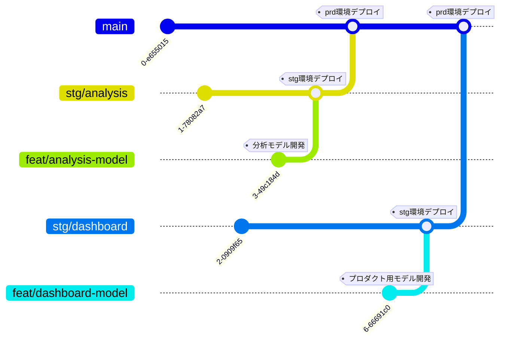

こんにちは。株式会社IVRy（アイブリー）のデータアナリストの [wada](https://note.com/wxy_zzz/n/nd1e905d15842) です。
IVRy ではデータモデルの管理のために [dbt Core](https://github.com/dbt-labs/dbt-core) を導入し始めているのですが、今回はプロダクトへのデータ転送パイプラインに dbt を導入した事例を紹介します。

# プロダクトについて

[IVRy](https://ivry.jp) は電話業務を効率化する対話型音声 AI SaaS です。

https://ivry.jp

プロダクトには、自動対応できた着電件数や IVRy を使うことによって効率化できた時間などの統計情報を確認できる機能があります。


*[「台所ようは」様の導入事例](https://ivry.jp/case/daidocoro-yoha/)から*

閲覧できる統計情報を大幅にアップデートしたダッシュボード機能が今月リリースされました。この機能では、IVR（音声自動応答）の各分岐の流入数や長期の統計情報など、より詳細な情報を確認することができます。


*機能イメージ*

# やったこと - dbt 導入

## dbt 導入前 - 課題

IVRy では解析用の各種データを BigQuery に集約しており、統計情報の元となる発着電イベントログも BigQuery に取り込んでいます。BigQuery 上の発着電イベントログから統計データを計算し、その結果を定期的にプロダクトに転送するデータパイプラインを [TROCCO](https://trocco.io) を使って実現しています。


*データの流れのイメージ（Before）*

ダッシュボード機能実現のためにクエリを大幅にアップデートする必要がありましたが、それにあたり、

- stg 環境で検証したクエリを正しく prd 環境にデプロイしたい
- クエリの計算ロジックの正しさのテストしたい

の 2 点が担保したいこととして挙げられました。
既存の統計データ計算用クエリは GUI から手動で直接 TROCCO に登録する形をとっていましたが、よりシステマチックな管理形態に移行することが一つの課題でした。

## dbt 導入後 - 改善されたこと

上記課題を解消するため、データモデリングの部分を dbt に寄せて「統計データモデルの作成」と「データの転送」を切り分けることで、集計結果の正しさを検証しやすい環境に変更しました。


*データの流れのイメージ（After）*

データ転送時のクエリに計算ロジックを持たせないようにしたので、集計クエリの開発自体は dbt に閉じて行えるようになりました。
クエリは GitHub を用いてバージョン管理できるようになり、さらに GitHub Actions での CI/CD によって stg/prd 環境毎のデプロイができるようになったので、稼働しているデータモデルの管理のしやすさも向上しています。

また、TROCCO のワークフローの中で dbt test を実行するようにしたことで、クリティカルなエラーが起きていないかをプロダクトへの転送前に検査できるようになりました。
input 側のデータに発生したエラーによってバッチ処理の結果が突然おかしくなるというのはあるあるな気がしますが、そういった事態を未然に防ぐ仕組みが入っているとかなり安心感があります。

# 今後の課題

プロダクトへのデータ転送パイプライン単体としてはシンプルに良くなったなという感想なのですが、全社横断的に dbt Core を導入するという視点で dbt project の管理体制をどうしていくべきかちょっと悩んでいます。

dbt は導入され始めたばかりで dbt というツール自体に詳しい人はまだ社内に多くないため、知見を集約しておく目的で、複数の dbt project を一つの GitHub リポジトリにまとめて管理しています。

```
(リポジトリ内のイメージ)
./dbt/
  ├ analysis/ (分析用の dbt project)
  │  ├ dbt_project.yml
  │  └ ...
  ├ dashboard/ (今回紹介したデータ転送パイプライン用の dbt project)
  │  ├ dbt_project.yml
  │  └ ...
  └ 他の dbt project ...
```

悩んでいるのは、上記のように複数の dbt project をモノレポで管理している時に、各 project の開発環境別のデプロイをどのように実現すべきかという点です。

一旦、`main` ブランチは、全 project について prd 環境にリリース可能な状態のものが入っているとしているのですが、問題は各 project の検証状態のもののデプロイをどう実現するかです。TROCCO は設定したブランチの最新の状態の dbt を実行するので、とりあえずは各 project に対して stg 環境用のコードに対応するブランチをそれぞれ作成して TROCCO から dbt 実行ができるようにしているのですが、この方針だと dbt project と同じ数の stg 環境用ブランチが増えてしまうので、今後管理が複雑になるのではないかと懸念しています。

現状のブランチ運用のイメージを図にすると以下のような状態です。


今は dbt project の数が多くないため、この形式でも運用できそうではあるのですが、今後 IVRy では [複数のプロダクトを立ち上げていく](https://pm-notes.com/pdm-voice-57/) ことが予想されるため、負荷なくスケールする仕組みに移行していきたいところ……

# 最後に

とまぁ、まだまだ改善するところもあるのですが、IVRy のデータ活用シーンに dbt が導入されたことで着実にデータの利活用が改善されているという実感があります。

IVRy では社会により大きなインパクトを与えるために、データを整備し、データを活用して事業やプロダクトを改善する仲間を募集しています。特に、この記事に興味を持ってくださったあなた！きっとデータアナリストだったりデータ基盤エンジニアだったりするに違いないと思いますので、是非ご検討ください！

https://www.notion.so/127eea80adae804da9d1c02f1489720e?pvs=21

https://www.notion.so/127eea80adae80dc99dac8782b964b68?pvs=21

カジュアル面談はこちらから！私が迷っている dbt project の管理体制について何かコメントくださるだけでも大歓迎です！

https://herp.careers/v1/ivry/wmZiOSAmZ4SQ
